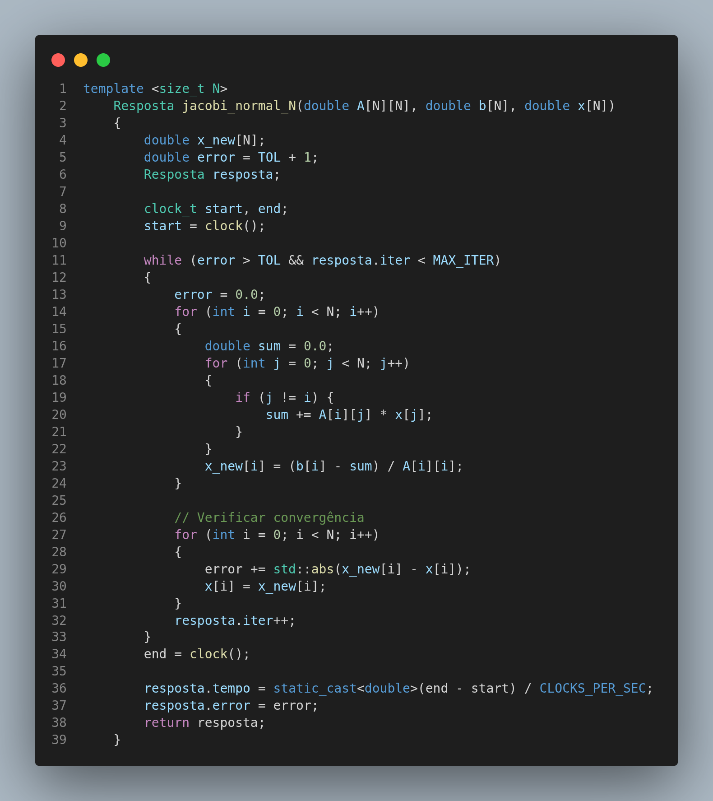
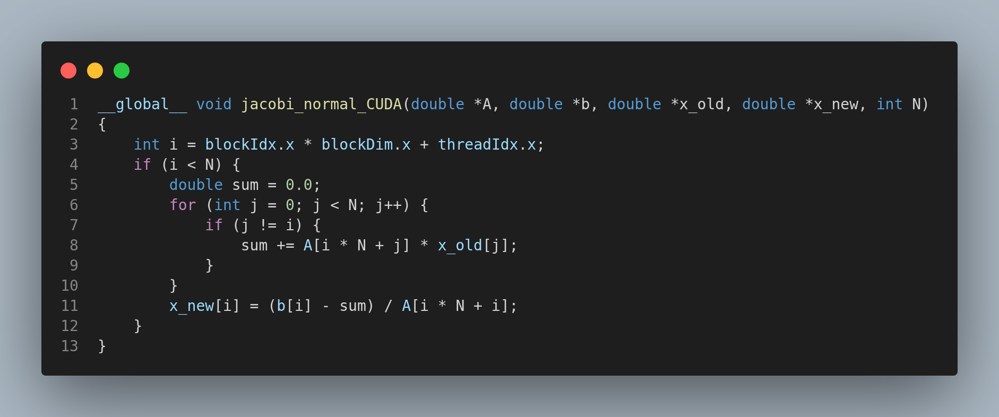
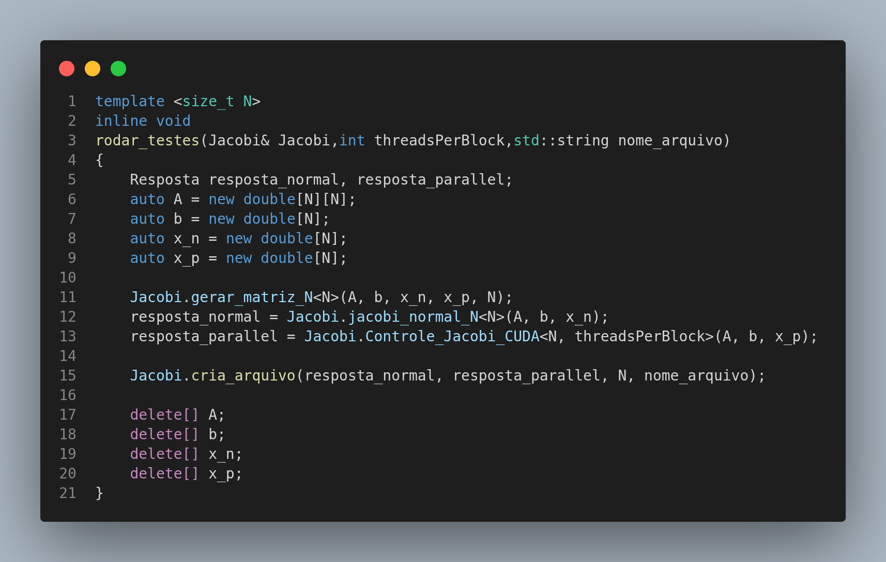
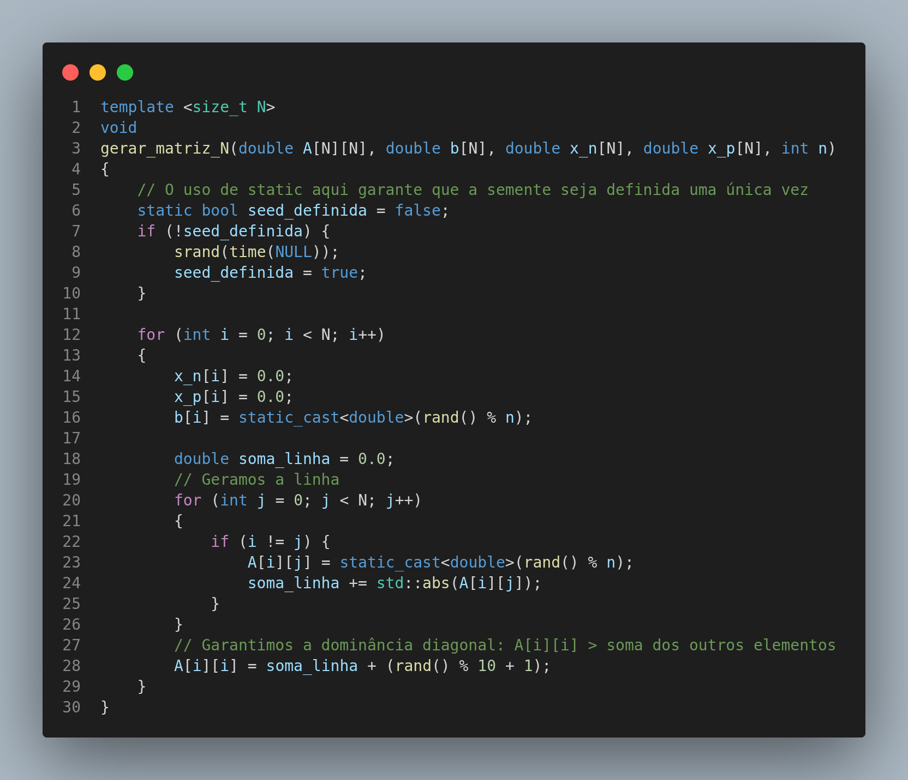
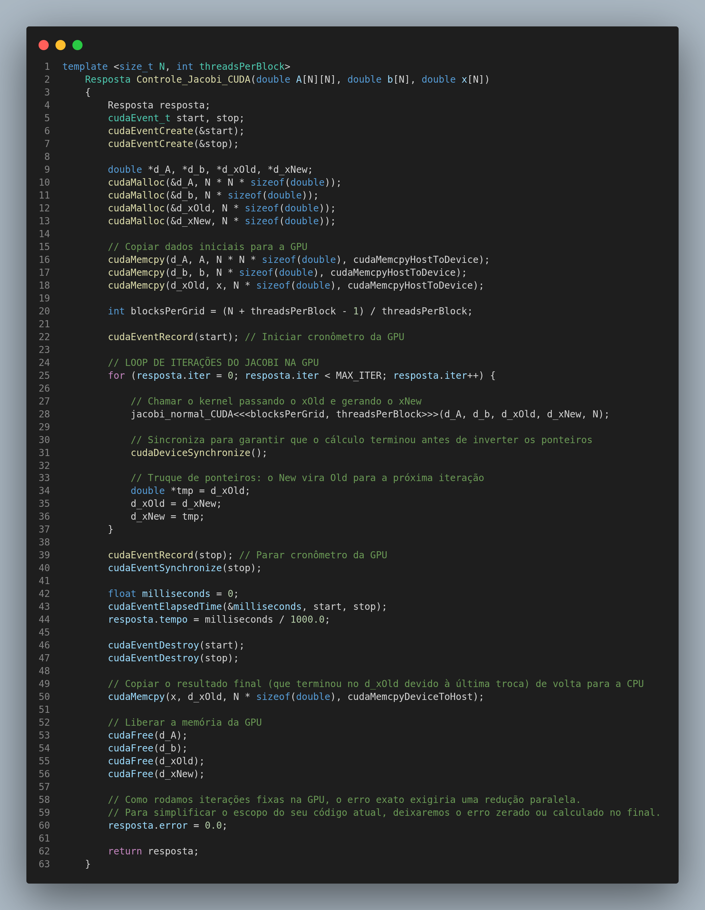

# Trabalho 01


Focado na resolução do **Método Iterativo de Jacobi**, usando metodo sem paralelismo e com paralelismo.

# Tabela de Arquivos

| Pastas | Descrição |
| :--- | :---: |
| **Jacobi.h** | Uma classe que contem as funções do **Método Iterativo de Jacobi** |
| **Resposta.h** | Vai criar variaveis que queira ver como `erro` ou `iter` |
| **main.cpp** | Onde realmente  acontece a chamada das funçoões do `Jacobi.h` |

## Codigo
Toda a estrutura do codigo foi feita para poder fazer testes com varios tamanho de **matrizes** como se pode ver na imagens abaixo:

| Imagens dos Codigos |
| :---: |
|   |
|   |
|   |

## Ideia Geral
O método de Jacobi resolve o sistema linear de forma iterativa. O procedimento consiste em:
1. escolher um vetor solução inicial (por exemplo, todos os valores iguais a zero);
2. calcular sucessivas aproximações da solução;
3. interromper o processo quando a solução convergir.


## Como executar

Para compilar o código com suporte a CUDA, tem que te um placa de video da NVIDA e para definir a quantidade de blocos de threads é no codigo bem no inicio da `main()`:

```bash
# Compilação
nvcc -O3 main.cu -o main

# Execução
./main
```