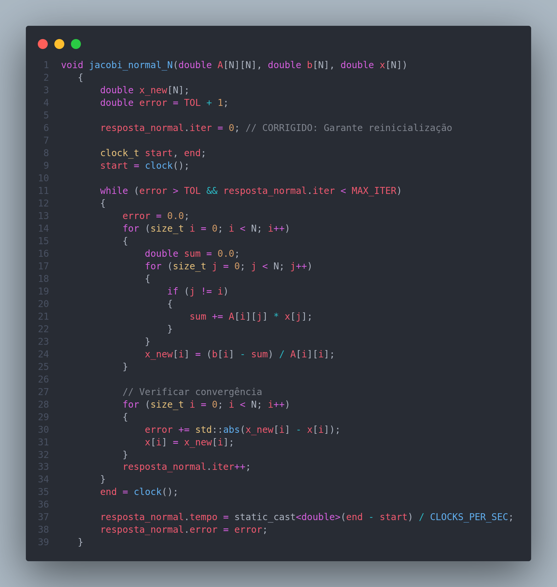
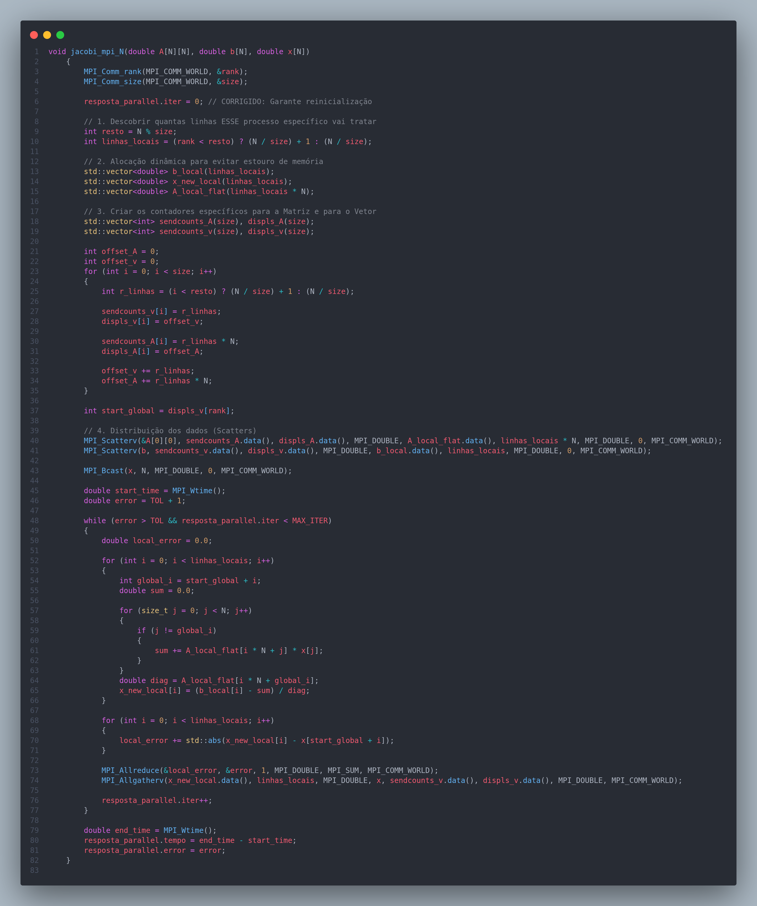
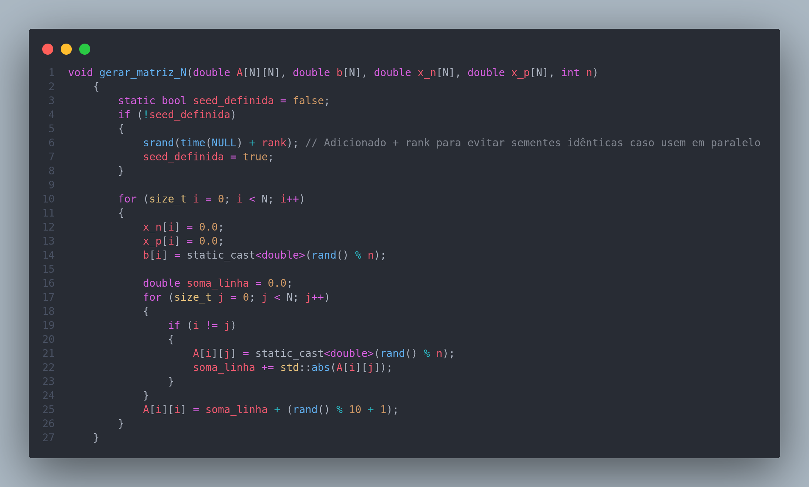
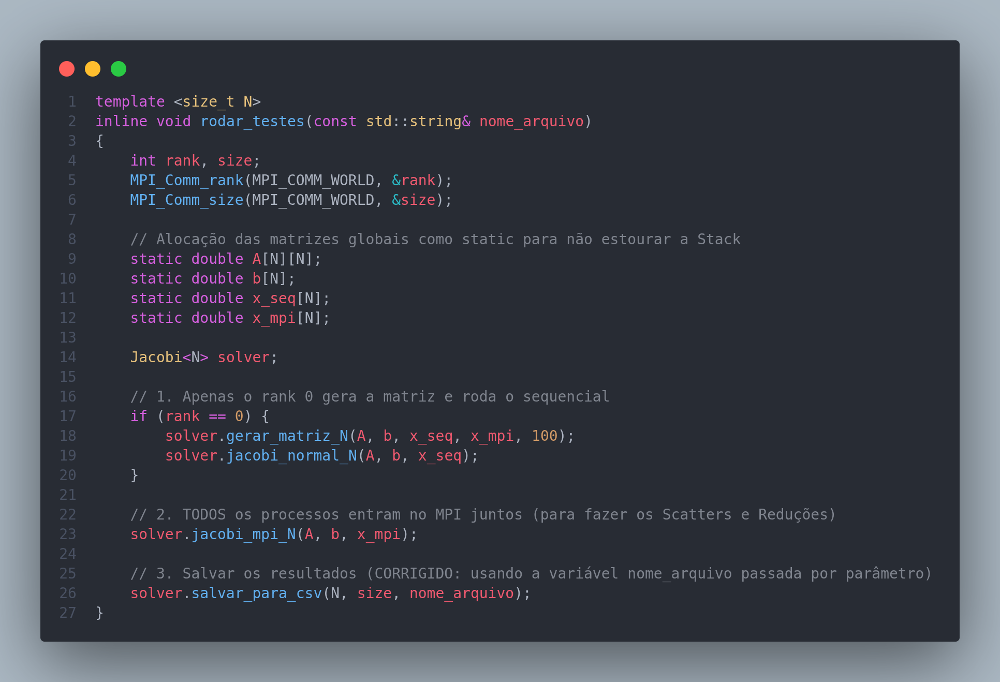
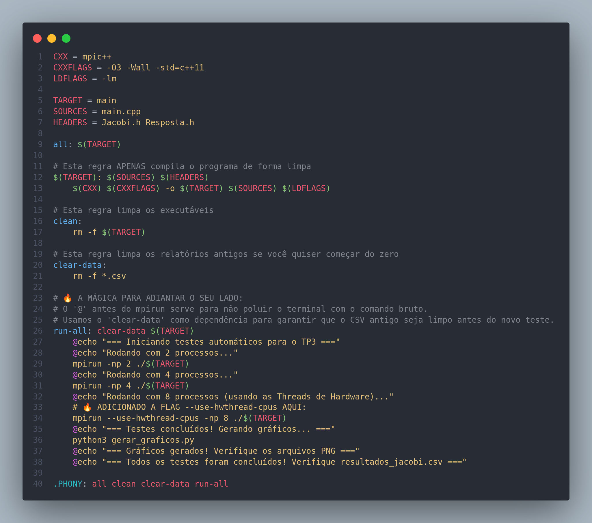

# Trabalho 03


Focado na resolução do **Método Iterativo de Jacobi**, usando metodo sem paralelismo e com paralelismo.

# Tabela de Arquivos

| Pastas | Descrição |
| :--- | :---: |
| **Jacobi.h** | Uma classe que contem as funções do **Método Iterativo de Jacobi** |
| **Resposta.h** | Vai criar variaveis que queira ver como `erro` ou `iter` |
| **main.cpp** | Onde realmente  acontece a chamada das funçoões do `Jacobi.h` |
| **gerar_graficos.py** | Script em Python que consome os dados obtidos e plota os gráficos de desempenho. |

## Codigo
Toda a estrutura do codigo foi feita para poder fazer testes com varios tamanho de **matrizes** como se pode ver na imagens abaixo:

| Imagens dos Codigos |
| :---: |
|   |
|   |
|  |

## Ideia Geral
O método de Jacobi resolve o sistema linear de forma iterativa. O procedimento consiste em:
1. escolher um vetor solução inicial (por exemplo, todos os valores iguais a zero);
2. calcular sucessivas aproximações da solução;
3. interromper o processo quando a solução convergir.


## Como executar
Para executar esse programa é necessario ter o **mpic++** instalado e funcional no seu computador. Depois de ter instaldo basta usar o comando a baixo para rodar o **Makefile**:
```bash
# Vai compilar os codigos
make

# Vai execuar todos os testes
make run-all
```

OBS: O **Makefile** esta configurado pra rogar um codigo em python para gera as imagens com os graficos e para isso é necessario instalar essa  bibliotecas caso queira que funcione:
```bash
# As bibliotecas necessarias
pip install pandas matplotlib
```